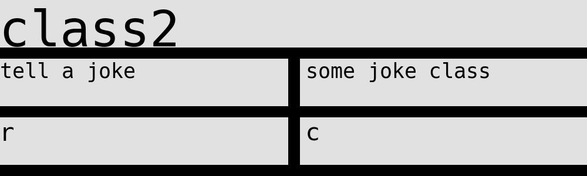

 # Generate CRC model image from prompt inputs.

## Usage:

Modify the toml file to change the source. 

Add a new section for a new class. Then follow the format "responsibility"="collaborator"

Run the python file to generate jpgs. They should be stored in a folder named "crc".

## Example

```toml
[class1]
"responsibility" = "collaborator"
"store some data" = "le_database"
```


```toml
[class2]
"tell a joke"="some joke class"
"r"="c"
```



